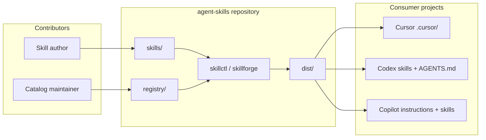
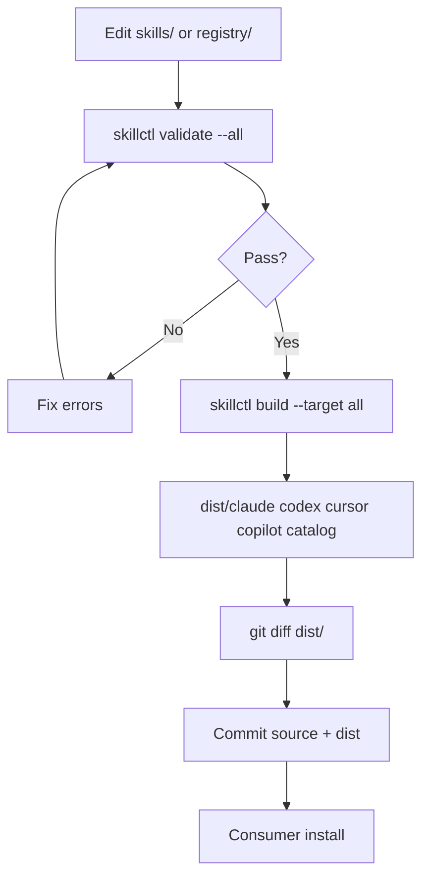
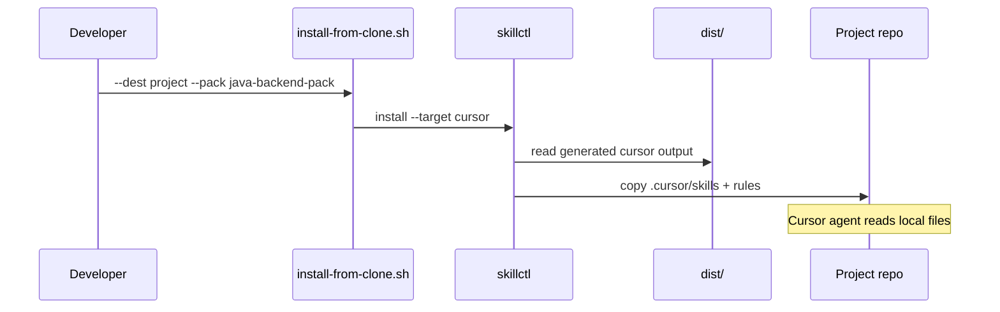

# High-Level Architecture — agent-skills

**Status:** As-built  
**Last updated:** June 2026  
**Requirements:** [Business Requirements Document](01-brd.md)

---

## 1. Purpose

This document describes how **agent-skills** is structured: canonical skill source, registry metadata, validation and build tooling, generated vendor output, and installation into consumer projects.

It reflects **what exists today**, not a multi-year roadmap.

---

## 2. System context



**Boundary:** The repository does not run agents or host skills at runtime. It produces **files** that agents read locally after install.

---

## 3. Architecture principles

| Principle | Implication |
| --- | --- |
| **Single canonical source** | Edit `skills/<id>/` only; never hand-edit `dist/` |
| **Separate content from listing** | Skills hold workflows; `registry/` holds packs, collections, backlog |
| **Validate before build** | `build` runs validation first; CI enforces the same |
| **Active means reviewed** | Active skills pass strict checks (no TODO, full metadata) |
| **Thin routing, deep bundles** | Cursor rules route to `.cursor/skills/<id>/` bundles |
| **Committed dist for consumers** | `dist/` in git enables install without Python |

---

## 4. Repository zones

```text
agent-skills/
├── skills/<skill-id>/       # Canonical skill source
│   ├── SKILL.md
│   ├── skill.yaml
│   ├── references/
│   ├── eval/prompt.md
│   └── scripts/ | assets/   # optional
├── registry/                # Lists and plans skills
│   ├── packs/
│   ├── collections/
│   ├── skill-backlog.yaml
│   ├── taxonomy.yaml
│   └── waves.yaml
├── dist/                    # Generated vendor + catalog output
│   ├── claude/
│   ├── codex/
│   ├── cursor/
│   ├── copilot/
│   └── catalog/
├── tools/skillforge/        # Python engine
├── tools/skillctl*          # CLI launchers
├── scripts/                 # install-from-clone.sh, git hooks
├── tests/
├── schemas/
└── docs/
```

| Zone | Mutability | Owner |
| --- | --- | --- |
| `skills/` | Human-authored | Skill authors |
| `registry/` | Human-authored | Catalog maintainers |
| `dist/` | **Generated only** | `skillctl build` |
| `tools/` | Engine code | Tooling contributors |

See also [registry/README.md](../../registry/README.md) and [AGENTS.md](../../AGENTS.md).

---

## 5. Skill model

### 5.1 Skill folder

Each skill is self-contained:

| Artifact | Role |
| --- | --- |
| `SKILL.md` | Agent workflow; YAML frontmatter (`name`, `description`) |
| `skill.yaml` | Machine metadata: domain, kind, **modes**, status, packs, collections, targets |
| `references/*.md` | Deep examples; must be linked from `SKILL.md` |
| `eval/prompt.md` | Eval scenario (recommended; validator warns if missing) |

### 5.2 Modes

Skills declare when agents should use them:

| Mode | Typical use |
| --- | --- |
| `planning` | Design, review, architecture, go/no-go |
| `coding` | Implement, refactor, test |

Some skills use both (e.g. major migrations). Canonical mode sets are enforced in `tools/skillforge/modes.py` for consistency.

### 5.3 Status lifecycle

```text
proposed (backlog only)
    → draft (promoted scaffold, TODO allowed)
    → active (shippable, in dist/)
    → deprecated / archived (future)
```

Only **active** (and optionally **recommended**) skills generate vendor install output by default.

---

## 6. Registry model

| Artifact | Purpose |
| --- | --- |
| `registry/packs/*.yaml` | Install bundles (e.g. `java-backend-pack`) |
| `registry/collections/*.yaml` | Browse/group labels (java, backend, migrations) |
| `registry/skill-backlog.yaml` | Skill IDs with status, priority, domain, wave |
| `registry/taxonomy.yaml` | Source definitions for backlog generation |
| `registry/waves.yaml` | Batch promotion groups |

**Rule:** Pack and collection YAML reference skill IDs that exist under `skills/`. Validation fails on unknown IDs.

---

## 7. Processing pipeline



### 7.1 Validation (`tools/skillforge/validate.py`)

Checks include:

- Skill folder naming and frontmatter
- Required `skill.yaml` fields (including `modes`, `targets`, `owners`)
- Referenced files exist and are linked from `SKILL.md`
- Pack/collection membership references valid skills
- Backlog schema and ID consistency
- **Active skills:** no `TODO` in `SKILL.md`
- **Eval:** warning if `skills/<id>/eval/prompt.md` missing

### 7.2 Build (`tools/skillforge/render.py` + adapters)

| Target | Output layout |
| --- | --- |
| **Claude Code** | `dist/claude/.claude/skills/<id>/` (SKILL.md + references/scripts/assets), `dist/claude/CLAUDE.md` |
| **Codex** | `dist/codex/skills/<id>/` (SKILL.md + references/scripts/assets), `dist/codex/AGENTS.md` |
| **Cursor** | `dist/cursor/.cursor/skills/<id>/` + thin `dist/cursor/.cursor/rules/<id>.mdc` + `AGENTS.md` |
| **Copilot** | `dist/copilot/.github/skills/<id>/`, `.github/instructions/*.instructions.md`, `copilot-instructions.md`, `AGENTS.md` |
| **Catalog** | `dist/catalog/*.md`, `skills.json` |

Routing logic (`routing.py`) rewrites reference paths in thin rules to point at bundle roots.

### 7.3 Install (`tools/skillforge/install.py`, `scripts/install-from-clone.sh`)

- Copies generated trees into `--dest`
- Filters by `--pack`, `--target`, optional `--modes`
- `--build` flag runs build if `dist/` missing

---

## 8. Component view (skillforge)

```text
tools/skillforge/
├── cli.py              # Typer/argparse entry
├── paths.py            # registry/, eval paths
├── parse.py            # YAML + SKILL.md frontmatter
├── models.py           # Domain types, enums
├── catalog.py          # Load repository graph
├── validate.py         # Validation engine
├── render.py           # Orchestrates adapters
├── routing.py          # Thin rule bodies, path rewrite
├── modes.py            # Canonical mode sets
├── backlog_gen.py      # Taxonomy → backlog
├── promote.py          # Backlog → draft skill folders
├── install.py          # Copy dist → project
├── filesystem.py       # Safe write/copy helpers
└── adapters/
    ├── claude.py
    ├── codex.py
    ├── cursor.py
    └── copilot.py
```

---

## 9. Data flow — install path



---

## 10. CI architecture

GitHub Actions (`.github/workflows/ci.yml`):

| Step | Command |
| --- | --- |
| Test | `python -m unittest discover -s tests` |
| Validate skills | `skillctl validate --all` |
| Validate backlog | `skillctl backlog validate` |
| Build | `skillctl build --target all` |
| Freshness | `git diff --exit-code dist/` |

Matrix: Ubuntu, macOS, Windows × Python 3.11, 3.12.

Local equivalent: **`make check`**.

Optional: `./scripts/install-git-hooks.sh` runs validation before commit.

---

## 11. Security and governance

| Topic | Approach |
| --- | --- |
| **Scripts in skills** | Review before merge; prefer inspection over blind execution |
| **Secrets** | Never embed credentials in skills or eval prompts |
| **Generated output** | Transparent, diffable; marked as generated |
| **Ownership** | `owners` in `skill.yaml` for active skills |
| **PII** | Skills must not instruct logging or exposing PII (align with org policies) |

---

## 12. Catalog reports (generated)

After `make catalog-build` or `make build`:

| Report | Path |
| --- | --- |
| Active skills | `dist/catalog/active-skills.md` |
| All skills JSON | `dist/catalog/skills.json` |
| Packs | `dist/catalog/packs.md` |
| Collections | `dist/catalog/collections.md` |
| Coverage by domain | `dist/catalog/coverage-by-domain.md` |
| Coverage by mode | `dist/catalog/coverage-by-mode.md` |
| Backlog | `dist/catalog/backlog.md` |
| Waves | `dist/catalog/waves.md` |

---

## 13. Scale workflow (backlog)

For adding many candidate skills without activating them:

```text
registry/taxonomy.yaml
    → skillctl backlog generate --merge
    → registry/skill-backlog.yaml (proposed)
    → skillctl backlog promote [--wave]
    → skills/<id>/ (draft + TODO)
    → human authoring
    → status: active + make check
```

Bulk generation is allowed for **backlog entries and draft scaffolds**, not for marking skills active without review.

---

## 14. Out of scope (current architecture)

Not implemented in this repository today:

- Root-level `evals/` runner with fixtures and reports
- `graph.py`, OpenAI API / Claude / Antigravity adapters
- `packages/` (npm, dotnet global tool)
- Installers (Homebrew, winget, scoop)
- Remote skill registry or versioned artifact publishing

These may be reconsidered if product requirements change; see [BRD §12](01-brd.md#12-future-considerations-not-committed).

---

## 15. Related documents

| Document | Audience |
| --- | --- |
| [BRD](01-brd.md) | Goals, user stories, acceptance criteria |
| [Authoring skills](../04-authoring-skills.md) | Skill authors |
| [CLI reference](../05-skillctl-reference.md) | Command details |
| [Contributing](../06-contributing.md) | PR and CI policy |
